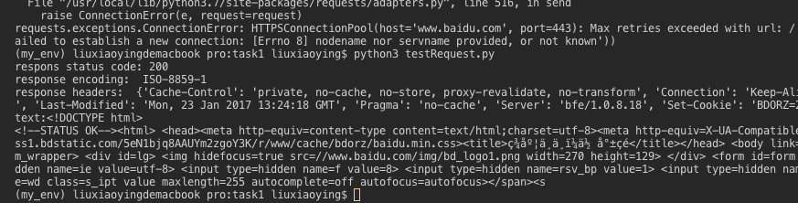
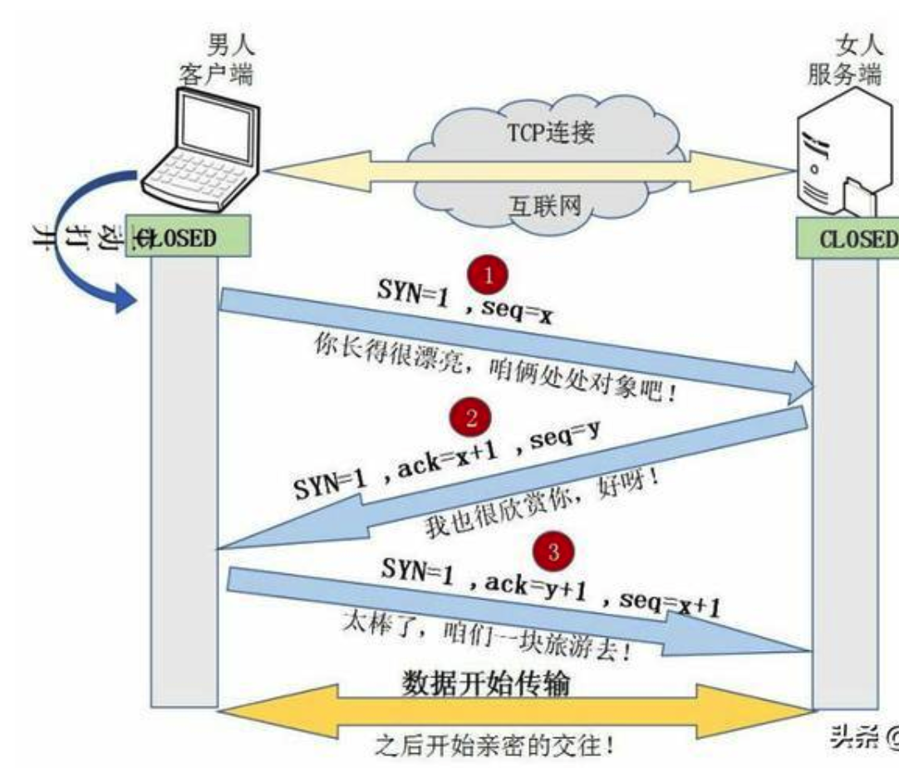

# **Task1（2天）**

## **1.1 学习get与post请求**

1. 学习get与post请求，尝试使用requests或者是urllib用get方法向[https://www.baidu.com/](https://www.baidu.com/)发出一个请求，并将其返回结果输出。 

输出的结果：

2. 如果是断开了网络，再发出申请，结果又是什么。了解申请返回的状态码。\
    答： 断开网络的情况下，请求出不去，所以没有返回任何信息，当然也就没有状态码!   \
    状态码：常见的 404、400、500 查看[https://www.runoob.com/http/http-status-codes.html](https://www.runoob.com/http/http-status-codes.html)

3. 了解什么是请求头，如何添加请求头。 \
    答：请求头是HTTP请求保存的其中一部分， 一个HTTP请求报文有请求行、请求头、空行、请求数据4个部分组成
    * 请求行：由请求方法字段、URL字段和HTTP协议版本字段3个字段组成，他们用空格分割。例如，GET/index.html HTTP/1.1 \
    根据HTTP标准。HTTP请求可以使用多种请求方法:\
    HTTP1.0 定义了三种请求方法：GET，POST和HEAD方法
    HTTP1.1 新增了五种请求方法：OPTIONS，PUT，DELETE，TRACE和CONNECT方法 

    * 请求头：请求头部分由关键字/值对组成，每行一堆，关键字和值用英语冒号进行分隔，典型的请求头有 \
        1.User_Agent: 产生请求的浏览器类型。\
        2.Accept: 客户端可是别的内容类型列表
        3.Host: 请求的主机名，允许多个域名痛楚一个IP地址，即虚拟主机
    * 空行：最后一个请求头之后是一个空行，发送回车符和换行符，通知服务器以下不再有请求头
    * 请求数据：请求数据不再GET方法中，而是在POST方法中使用。POST方法适用于需要客户填写表单的场合。与请求数据相关最常用的请求头是Content-Type和Conten-Length
### 实例
1).GET

    //请求首行
    GET /hello/index.jsp HTTP/1.1
    //请求头信息，因为GET请求没有正文
    Host: localhost
    User-Agent: Mozilla/5.0 (Windows NT 5.1; rv:5.0) Gecko/20100101 Firefox/5.0
    Accept: text/html,application/xhtml+xml,application/xml;q=0.9,*/*;q=0.8
    Accept-Language: zh-cn,zh;q=0.5
    Accept-Encoding: gzip, deflate
    Accept-Charset: GB2312,utf-8;q=0.7,*;q=0.7
    Connection: keep-alive
    Cookie: JSESSIONID=369766FDF6220F7803433C0B2DE36D98
    //空行
    //因为GET没有正文，所以下面为空
2).POST

    // 请求首行
    POST /hello/index.jsp HTTP/1.1
    //请求头信息
    Host: localhost
    User-Agent: Mozilla/5.0 (Windows NT 5.1; rv:5.0) Gecko/20100101 Firefox/5.0
    Accept: text/html,application/xhtml+xml,application/xml;q=0.9,*/*;q=0.8
    Accept-Language: zh-cn,zh;q=0.5
    Accept-Encoding: gzip, deflate
    Accept-Charset: GB2312,utf-8;q=0.7,*;q=0.7
    Connection: keep-alive
    Referer: http://localhost/hello/index.jsp
    Cookie: JSESSIONID=369766FDF6220F7803433C0B2DE36D98
    Content-Type: application/x-www-form-urlencoded 
    Content-Length: 14 
    // 这里是空行
    //POST有请求正文    
    username=hello

## **1.2 正则表达式**

1. 学习什么是正则表达式并尝试一些正则表达式并进行匹配。 \
    答：正则表达式式处理字符串的强大工具，他有自己特定的语法结构。又称为正则表示法、正规表示式、常规表示法等。是计算机科学的一个概念。通常被用来检索、替换那些匹配某个模式的文本。
    常用的匹配规则：
    * \w 匹配字母、数字下划线
    * \W 匹配不是字母、数字及下划线的字符
    * \s 匹配任意空白字符，等价于[\t\n\r\f]
    * \S 匹配任意非空白字符，[\s\S]用来匹配任意的字符（万能符）
    * \d 匹配任意数字，等价于[0-9]
    * \D 匹配任意非数字的字符
    * \A 匹配字符串开头
    * \Z 匹配字符串结尾，如果存在换行，只匹配到换行前到结束字符串
    * \z 匹配字符串结尾，如果存在换行，同时匹配换行符
    * \G 匹配最后匹配完成的位置
    * \n 匹配一个换行符
    * \t 匹配一个制表符（tab键）
    * \r python中字符串前面加上r表示原生字符串，有了原生字符串，很好的避免了\转义时漏写反斜杠的错误，同时也更加直观
    * ^	匹配一行字符串开头
    * $	匹配一行字符串结尾
    * .	匹配任意字符，处理换行符
    * […]	用来表示一组字符，单独列出，比如[mk231]匹配m、k、2、3或1
    * [^…] 不在[]中的字符，比如[^12] 不包含1、2的字符
    * * 匹配0个或多个表达式
    * + 匹配1个或多个表达式
    * ? 匹配0个或1个前面的正则表达式定义的片段，非贪婪模式
    * {n}	精确匹配n个前面的表达式
    * {n,m} 匹配n到m次由前面正则表达式定义的片段，贪婪模式
    * a|b 匹配a或者b，匹配左右任一表达式，优先匹配左边
    * () 匹配括弧内的表达式，也表示一个组
    * (?p<name>) 分组起别名
    * (?P=name) 引用别名为name分组匹配到的字符串 \

    示例：URL的匹配：[a-zA-z]+://[^\s]*， [a-zA-z]+表示中括弧中的内容匹配一次或多次，中括弧的内容匹配所有的英文字母，接着是匹配一个：，两个//，[^\s]*表示空格除了空白字符外的任意字符出现一次或多次。
    

2. 然后结合requests、re两者的内容爬取[https://movie.douban.com/top250](https://movie.douban.com/top250)里的内容,要求抓取名次、影片名称、年份、导演等字段。\

    a. re是用于python 使用正则表达式的一个包: 
    常用函数: 
    * re.match(正则表达式，等待匹配字符串): 从头开始匹配，用来进行正则匹配检的方法，如果match，则返回match的对象，反之返回None，而不是空字符串！

    * re.search(正则表达式，等待匹配字符串): 不同于match的从头开始匹配，search匹配会扫描整个字符串，返回第一个match的内容，如果没有返回None

    * re.findall(正则表达式，等待匹配字符串): 上面两种方法都是返回一个match的结果，如果要获取所有match的内容，显然需要用到findall()方法，该方法会搜索整个字符串，并返回所有符合匹配规则的内容，反之返回None

    * re.sub(正则表达式，替换后的字符，等待匹配字符串): re还可以用于修改匹配的字符，这个时候就使用sub函数了

    * compile(): 可以将正则表达式编译成正则表达对象，以便在后面的匹配中进行重新使用！

    b. 抓取网页数据
        * 一个页面显示25条数据，url的变化是每加一页之后：
        https://movie.douban.com/top250?start=50&filter= 中的start就会加25哦

### GET与POST请求的笔记：
GET主要用于获取信息，是没有副作用的 \
POST主要用于修改服务器上的数据，有副作用

GET、POST请求报文上的区别

* GET和POST是HTTP协议中两种请求方式，而HTTP协议是基于TCP/IP的应用层协议，无论是GET还是POST，用的都是同一个传输层协议，所以在传输上，没有区别。   

* 报文格式上，不带参数时，最大的区别就是第一行方法名不同，仅仅是报文的几个字符不同而已
POST报文：POST /url HTTP/1.1 
GET报文：GET /url HTTP/1.1 

* 带参数时的区别：
在一般的约定下，GET方法的参数应该放在url中，而POST方法参数应该放在body中

* GET方法参数写法是固定的吗？
在约定中，我们参数是写在？后面，用&分割

* GET方法的长度限制是怎么回事？
网络上都会提到浏览器地址栏输入的参数是有限的。 \
首先，HTTP 协议没有 Body 和 URL 的长度限制，对 URL 限制的大多是浏览器和服务器的原因。\
浏览器原因就不说了，服务器是因为处理长 URL 要消耗比较多的资源，为了性能和安全（防止恶意构造长 URL 来攻击）考虑，会给 URL 长度加限制。

* 要想安全传输使用http可以吗？
从传输角度来说，GET和POST都是不安全的，因为HTTP在网络上是明文传输的，只要在网络节点上抓包，就能完整的获取数据 \ 
要想安全传输，就只有进行加密，也就是HTTPS